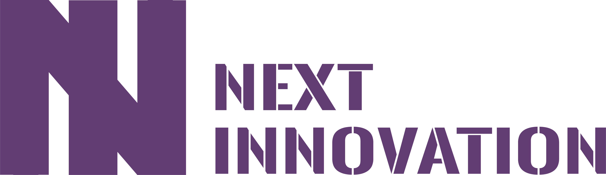

# 8214 FRC 2022

 

Team 8214's 2022 FRC robot code, written in Java and NI's custom robot control framework [NI-Skeleton](https://github.com/FRCNextInnovation/NI-Skeleton). 

The code is written by [Jetbrains Idea](https://www.jetbrains.com/idea/) and follows NI programming format([NI-Programming-Guide](https://github.com/FRCNextInnovation/NI-Programming-Guide)).

## Setup Instructions

### General

1. Clone this repo
2. Run ``./gradlew`` to download gradle and needed FRC/Vendor lib
3. Run ``./gradlew tasks`` to see available options

### VS Code(Official IDE)

1. Install [WPILIB](https://docs.wpilib.org/en/stable/docs/software/vscode-overview/vscode-basics.html) extension through market
2. Right click ``build.gradle`` and enjoy

### Idea

1. Install [FRC](https://plugins.jetbrains.com/plugin/9405-frc) plugin through market
2. Choose the build task and enjoy

## Code Highlights

### Common

- Custom robot control framework, run robot control loop in 100-200hz(Org 50hz)
- Design all subsystem as a state-machine
- Virtual OI layer for clean teleop and auto control logic

### Teleop

- Field-centric swerve drive
- Full time auto-aim through limelight 3 and odometry(Shoot even limelight broken and never lost target)
- Automatic wrong ball rejection by color sensor and fused odometry(Shoot to hanger automatically)
- REV color sensor data are transformd to UART by Pico
- Feedforward compensation to turret control through chassis angular vel and relative vel to vision target
- System identification to flywheel, run fly wheel by simple feedforward model
- Build shooting parameters by linear interpolated tree map(Hood angle & flywheel rpm)
- Semi-automated climber through state-machine using encoder positions and Bang-bang Controller

### Auto

- Trajectory generator based on Quintic Hermite Spline with swerve kinematic constrain
- Drive motion planner based on Adaptive Pure Pursuit Following Controller with Pure P Controller
- Fused odometry in Unscented Kalman Filter base on wheel IMU odometry and vision odometry
- Mode chooser and executer based on action system